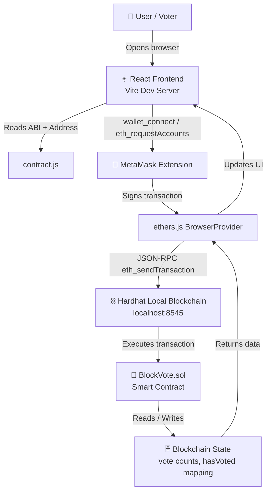

# 🗳️ BlockVote — Decentralized Student Voting DApp

> **College Mini-Project | Blockchain Technology**

---

## 1. Project Title

**BlockVote** — Decentralized Student Voting DApp

---

## 2. Problem Statement

Traditional voting systems rely on centralized servers that are vulnerable to tampering, data loss, and lack of transparency. A student election held through a college portal or paper-based system can be manipulated, and there is no way for voters to independently verify the results. This creates a fundamental trust problem.

---

## 3. Objective

To design and implement a **fully decentralized**, **transparent**, and **tamper-proof** voting application where:

- Votes are stored permanently on the Ethereum blockchain.
- Each wallet address can vote exactly **once** — enforced by the smart contract.
- Anyone can independently **verify** the vote counts by reading the blockchain.
- No central authority controls the election.

---

## 4. Features

| Feature | Description |
|---|---|
| 🦊 MetaMask Wallet Login | Connect and authenticate using MetaMask |
| 🗳️ On-Chain Voting | Votes are stored in the Solidity smart contract |
| 🔒 Duplicate Vote Prevention | Smart contract rejects any second vote from the same wallet |
| 📊 Live Results | Vote counts are read directly from the blockchain |
| 📡 Real-time Updates | UI refreshes after each confirmed transaction |
| 🔄 Manual Refresh | Fetch latest results from the blockchain on demand |
| ✅ Transaction Status | Full status feedback from submission to confirmation |

---

## 5. Technology Stack

| Layer | Technology |
|---|---|
| Smart Contract | Solidity 0.8.19 |
| Local Blockchain | Hardhat (EVM node) |
| Blockchain Library | ethers.js v6 |
| Frontend Framework | React 18 + Vite |
| Wallet | MetaMask browser extension |
| Styling | Vanilla CSS |
| Package Manager | npm |

---

## 6. System Architecture



### Data Flow Summary

```
User  →  React UI  →  MetaMask  →  ethers.js  →  Hardhat Node  →  Smart Contract  →  Blockchain
```

---

## 7. Smart Contract Functions

```
BlockVote.sol
│
├── constructor()
│   └── Initializes candidates: Candidate A, B, C with 0 votes
│
├── vote(uint256 candidateIndex)  [payable: no]
│   ├── require: !hasVoted[msg.sender]
│   ├── require: candidateIndex < candidates.length
│   ├── candidates[candidateIndex].voteCount++
│   ├── hasVoted[msg.sender] = true
│   └── emit VoteCast(msg.sender, candidateIndex)
│
├── getCandidate(uint256 index) → (string name, uint256 voteCount)
│   └── view — reads single candidate
│
├── getCandidates() → (string[] names, uint256[] votes)
│   └── view — reads all candidates in one call
│
├── checkHasVoted(address voter) → bool
│   └── view — checks if address has voted
│
└── getCandidateCount() → uint256
    └── view — returns number of candidates
```

---

## 8. How the DApp Works

1. **User opens the app** → React frontend loads in browser.
2. **User clicks "Connect MetaMask"** → MetaMask extension pops up.
3. **MetaMask asks for permission** → User approves connection.
4. **Frontend reads contract** → Fetches candidates and vote counts using `getCandidates()`.
5. **Frontend checks vote status** → Calls `checkHasVoted(address)` to see if wallet already voted.
6. **User clicks "Vote"** → Frontend calls `contract.vote(candidateIndex)` via ethers.js.
7. **MetaMask asks for confirmation** → User confirms the blockchain transaction.
8. **Transaction is sent to Hardhat** → Local EVM processes and mines the transaction.
9. **Smart contract validates** → Checks no duplicate vote, valid index, stores vote.
10. **Frontend polls confirmation** → `tx.wait()` waits for block confirmation.
11. **UI updates** → Refreshes vote counts from blockchain and shows success message.

---

## 9. Installation

### Prerequisites

- [Node.js](https://nodejs.org/) v18 or later
- [MetaMask browser extension](https://metamask.io/)
- Git (optional)

### Clone / Navigate to Project

```bash
cd BlockVote
```

### Install Smart Contract Dependencies

```bash
npm install
```

### Install Frontend Dependencies

```bash
cd frontend
npm install
cd ..
```

---

## 10. Deployment

### Step 1 — Compile the smart contract

```bash
npx hardhat compile
```

### Step 2 — Start the local Hardhat blockchain (keep this terminal open)

```bash
npx hardhat node
```

You will see 20 test accounts with 10,000 ETH each printed in the terminal. **Copy Account #0's private key** for MetaMask.

### Step 3 — Deploy the contract (open a new terminal)

```bash
npx hardhat run scripts/deploy.js --network localhost
```

You will see output like:

```
✅  Contract deployed successfully!
📋  Contract Address: 0x5FbDB2315678afecb367f032d93F642f64180aa3
```

### Step 4 — Configure the frontend

Open `frontend/src/contract.js` and replace:

```js
export const CONTRACT_ADDRESS = "PASTE_CONTRACT_ADDRESS_HERE";
```

With:

```js
export const CONTRACT_ADDRESS = "0x5FbDB2315678afecb367f032d93F642f64180aa3";
// ↑ use YOUR actual deployed address
```

### Step 5 — Start the React frontend

```bash
cd frontend
npm run dev
```

Open [http://localhost:3000](http://localhost:3000) in your browser.

---

## 11. MetaMask Setup

### Add Hardhat Local Network

1. Open MetaMask → Settings → Networks → Add a network manually.
2. Fill in:

| Field | Value |
|---|---|
| Network Name | Hardhat Local |
| New RPC URL | `http://127.0.0.1:8545` |
| Chain ID | `31337` |
| Currency Symbol | `ETH` |

3. Click **Save**.

### Import a Test Account

1. From the `npx hardhat node` terminal output, copy the **private key** of **Account #0** (starts with `0x`).
2. MetaMask → Click account icon → Add account or hardware wallet → **Import account**.
3. Paste the private key → click **Import**.

> ⚠️ **Never use Hardhat test private keys with real ETH!**

---

## 12. Testing

### Run all smart contract tests

```bash
npx hardhat test
```

### What the tests cover

| Test Group | Tests |
|---|---|
| Deployment | Contract deploys, has 3 candidates, all start at 0 votes |
| Candidates | Candidate A/B/C names, getCandidates() returns all |
| Voting | Can vote for each candidate, counts increase, event emitted |
| Duplicate Prevention | hasVoted set to true, second vote reverts with message |
| Invalid Input | Out-of-range index reverts, invalid getCandidate() reverts |

### Expected test output

```
  BlockVote Smart Contract

    Deployment
      ✔ Should deploy the contract successfully
      ✔ Should initialize exactly 3 candidates
      ✔ Should initialize all candidates with 0 votes

    Candidates
      ✔ Should have Candidate A as the first candidate
      ✔ Should have Candidate B as the second candidate
      ✔ Should have Candidate C as the third candidate
      ✔ getCandidates() should return all three names and votes

    Voting
      ✔ Should allow a user to vote for Candidate A (index 0)
      ✔ Should allow a user to vote for Candidate B (index 1)
      ✔ Should allow a user to vote for Candidate C (index 2)
      ✔ Should increase vote count correctly with multiple voters
      ✔ Should emit a VoteCast event with correct args

    Duplicate Vote Prevention
      ✔ Should mark a wallet as voted after voting
      ✔ Should revert if the same wallet tries to vote twice
      ✔ Should NOT mark a non-voter wallet as voted

    Invalid Input
      ✔ Should revert when voting with an out-of-range candidate index
      ✔ Should revert getCandidate() with an invalid index

  17 passing (Xms)
```

---

## 13. Expected Output

### Terminal — after `npx hardhat node`

```
Started HTTP and WebSocket JSON-RPC server at http://127.0.0.1:8545/

Accounts
========
Account #0: 0xf39Fd6e51aad88F6F4ce6aB8827279cffFb92266 (10000 ETH)
Private Key: 0xac0974bec39a17e36ba4a6b4d238ff944bacb478cbed5efcae784d7bf4f2ff80
...
```

### Terminal — after deploying

```
─────────────────────────────────────────
  BlockVote — Deploying Smart Contract
─────────────────────────────────────────
  Deployer address : 0xf39Fd6e51aad88F6F4ce6aB8827279cffFb92266
  Deployer balance : 10000.0 ETH

  Deploying BlockVote contract...

─────────────────────────────────────────
  ✅  Contract deployed successfully!
  📋  Contract Address: 0x5FbDB2315678afecb367f032d93F642f64180aa3
─────────────────────────────────────────

  Initialized Candidates:
    [0] Candidate A — 0 votes
    [1] Candidate B — 0 votes
    [2] Candidate C — 0 votes
```

### Browser — UI behaviour

- Page loads → vote counts show 0 for each candidate.
- Connect MetaMask → wallet address appears.
- Vote for Candidate A → MetaMask confirmation popup.
- Confirm → "Transaction pending…" → "Vote submitted successfully!".
- Candidate A vote count updates to 1.
- Vote buttons change to "✓ Already Voted".

---

## 14. Advantages

- **Tamper-proof** — Votes stored on immutable blockchain.
- **Transparent** — Anyone can verify results by reading the contract.
- **No central authority** — No administrator can change votes.
- **Pseudonymous** — Votes tied to wallet address, not real identity.
- **Trustless** — Smart contract enforces rules automatically.
- **No backend** — Eliminates server-side vulnerabilities.

---

## 15. Limitations

- **Wallet-based identity** — One wallet per vote; a person can create multiple wallets.
- **Public vote** — Blockchain is public; votes are traceable by wallet address.
- **Gas fees** — Real networks require ETH to pay for transactions.
- **MetaMask required** — Users must install and configure MetaMask.
- **No voter registration** — Any wallet can vote in this demo version.
- **Local only** — Runs on Hardhat local node; not deployed to a public testnet.

---

## 16. Future Scope

- Deploy to a public Ethereum testnet (Sepolia) or mainnet.
- Add voter whitelist managed by admin (only registered student IDs can vote).
- Integrate zero-knowledge proofs (ZK-SNARKs) for private voting.
- Add voting deadline (block timestamp-based) to the smart contract.
- Multi-election support — allow admin to create multiple election rounds.
- IPFS for storing candidate metadata, manifestos.
- Mobile wallet support (WalletConnect).

---

## 17. Conclusion

BlockVote demonstrates the core principles of blockchain technology — decentralization, immutability, and trustless execution — applied to a real-world use case: student elections. The smart contract guarantees that each wallet votes exactly once, all votes are permanently recorded, and results are verifiable by anyone. This project showcases how Solidity, Hardhat, ethers.js, and React can be combined to build a functional decentralized application from the ground up.

---

## Quick Command Reference

```bash
# 1. Install dependencies (root)
npm install

# 2. Install frontend dependencies
cd frontend && npm install && cd ..

# 3. Compile contract
npx hardhat compile

# 4. Run tests
npx hardhat test

# 5. Start local blockchain (Terminal 1)
npx hardhat node

# 6. Deploy contract (Terminal 2)
npx hardhat run scripts/deploy.js --network localhost

# 7. Start frontend (Terminal 2, after updating contract.js)
cd frontend && npm run dev
```

---

*Built with ❤️ using Solidity · Hardhat · ethers.js · React · Vite*
